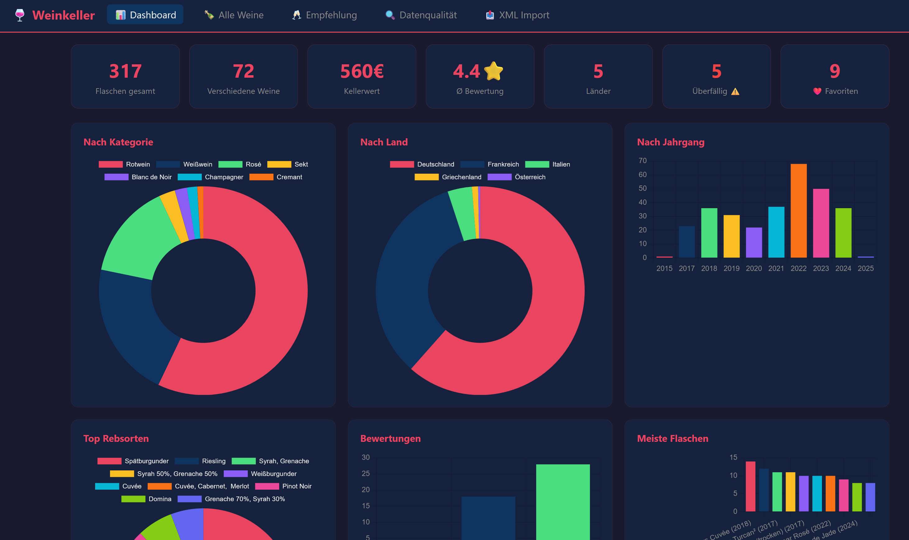
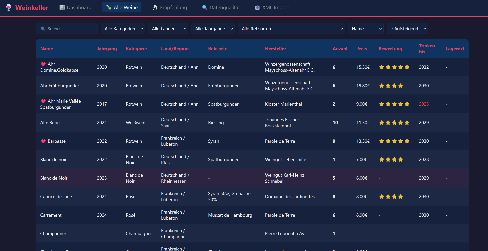
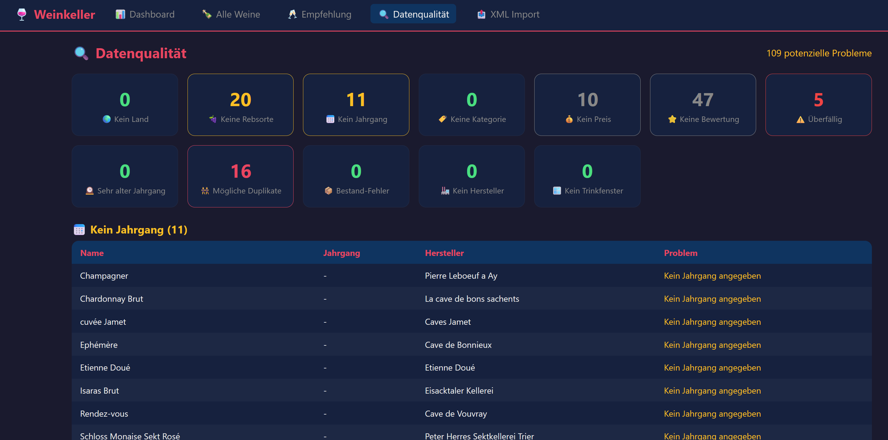
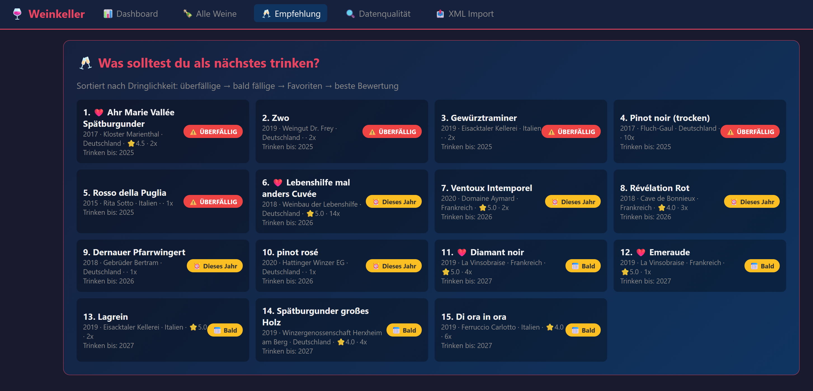
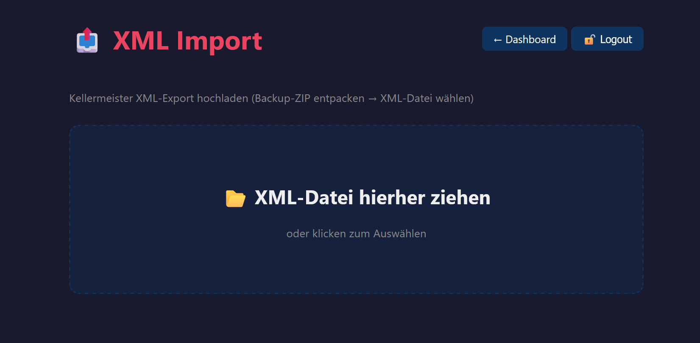

# kellermeister-dashboard
Dashboard for the Kellermeister App

Setup:
- mysql < setup.sql
- Adjust DB credentials and upload password in config.php
- Upload to PHP server (Apache/Nginx)
- Export CSV from Kellermeister → upload

Pictures:

